# YTB-DL Maintained

> 本项目根据原项目 [thsrite/ytb-dl](https://github.com/thsrite/ytb-dl) 修改并继续维护。
> 原项目年久失修后，部分功能已经无法满足当前 YouTube / yt-dlp / NAS 自托管环境的使用需求，本维护版围绕docker部署、稳定下载、自动合并音视频、远程推送下载和 Telegram 通知做了二次开发。

YTB-DL Maintained 是一个面向 NAS / Docker 环境的 YouTube 下载 Web 工具。它提供网页解析下载、登录保护、API Token、Telegram 下载通知、Telegram 发送链接触发下载，以及暴力猴脚本远程推送下载能力。

## 功能特性

- Web 登录验证，避免下载页面裸露在公网。
- API Token 验证，便于脚本、自动化或远程推送调用。
- 支持 YouTube 视频信息解析、格式选择和历史记录。
- 默认下载策略自动选择视频和音频并合并，避免下载后无声音。
- 格式列表标注是否含音频，视频-only 格式会自动组合最佳音频。
- 支持 `cookies.txt`，可使用 Get cookies.txt 等浏览器扩展导出的 Cookie 文件。
- 支持 CookieCloud 同步 Cookie。
- 支持 yt-dlp 更新到持久化目录，减少镜像年久失修导致的解析失败。
- 支持 Telegram 下载开始、完成、失败通知。
- 支持向 Telegram Bot 发送 YouTube 链接自动创建下载任务。
- 支持暴力猴脚本在 YouTube 页面远程推送下载任务。
- 支持群晖 / NAS 下载目录映射，并在通知中显示宿主机路径。

## 界面预览

### Web 界面

<table>
  <tr>
    <td>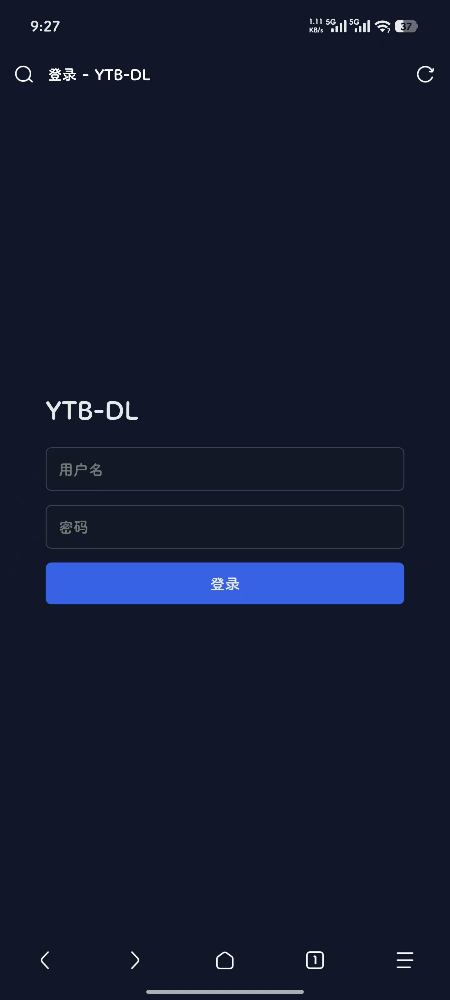</td>
    <td>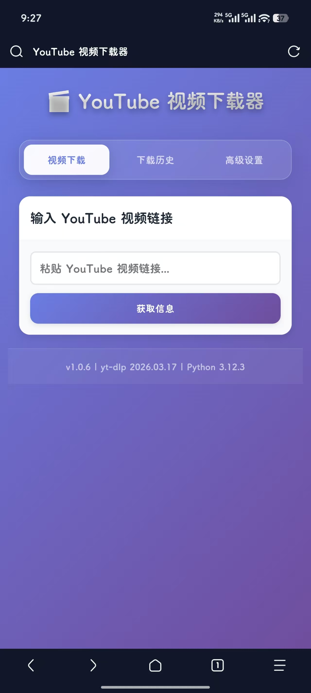</td>
    <td>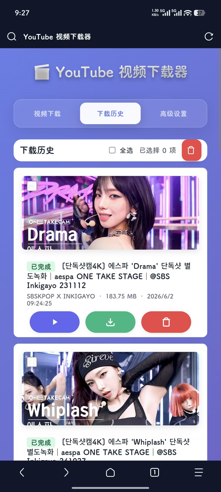</td>
    <td>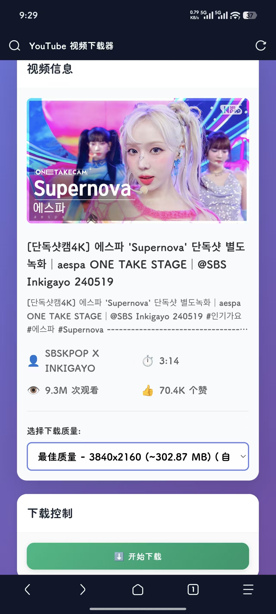</td>
  </tr>
  <tr>
    <td>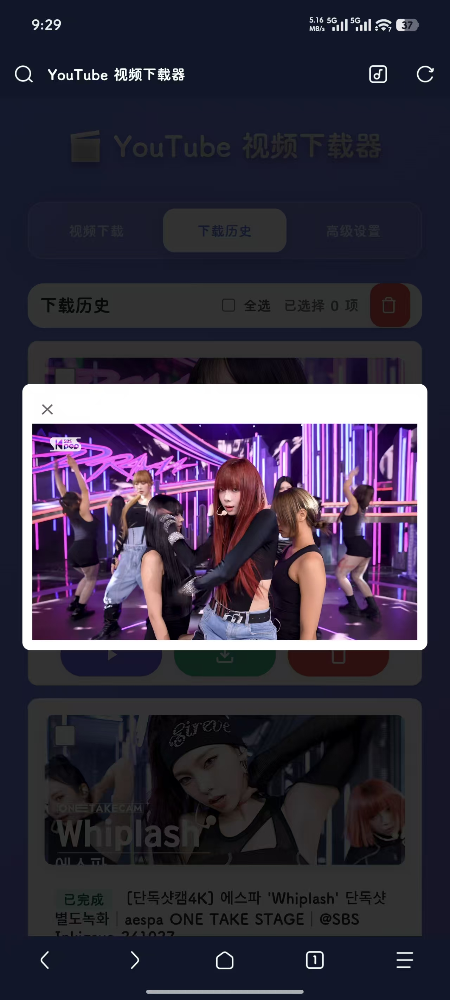</td>
    <td>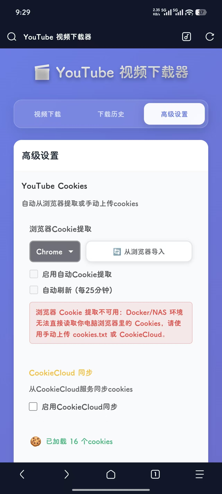</td>
    <td>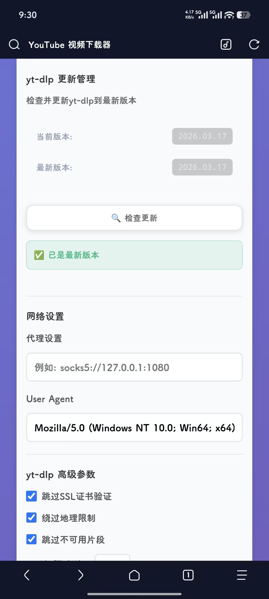</td>
    <td>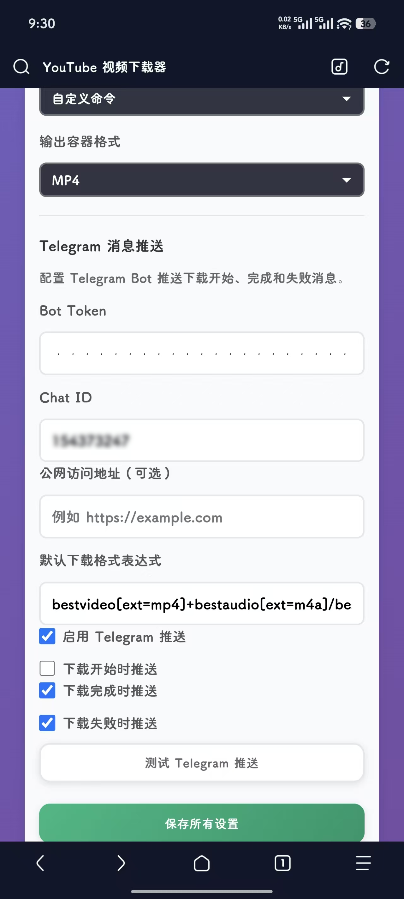</td>
  </tr>
</table>

### Telegram 消息

<table>
  <tr>
    <td width="50%">
      <strong>后台下载完成通知</strong><br>
      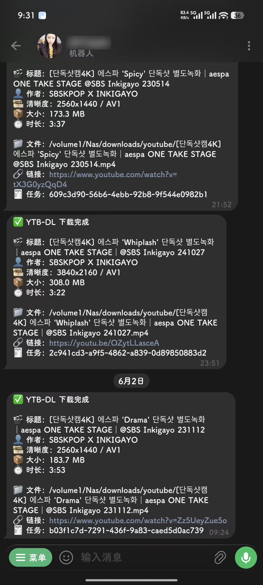
    </td>
    <td width="50%">
      <strong>向机器人发送链接自动下载</strong><br>
      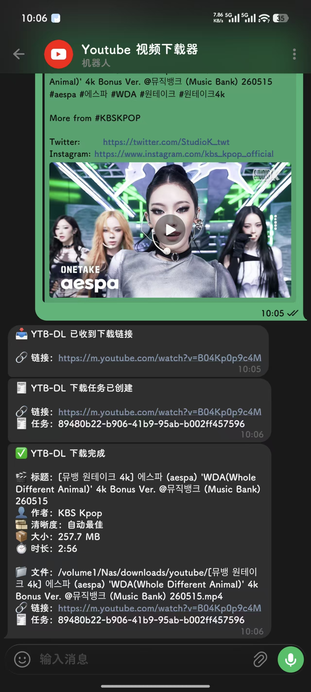
    </td>
  </tr>
</table>

### 暴力猴远程推送

<table>
  <tr>
    <td width="50%">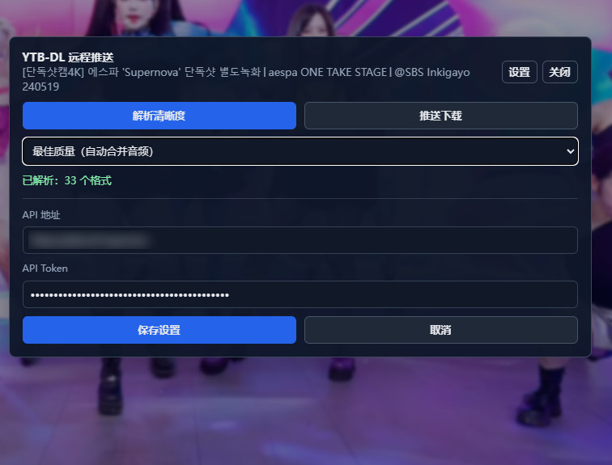</td>
    <td width="50%">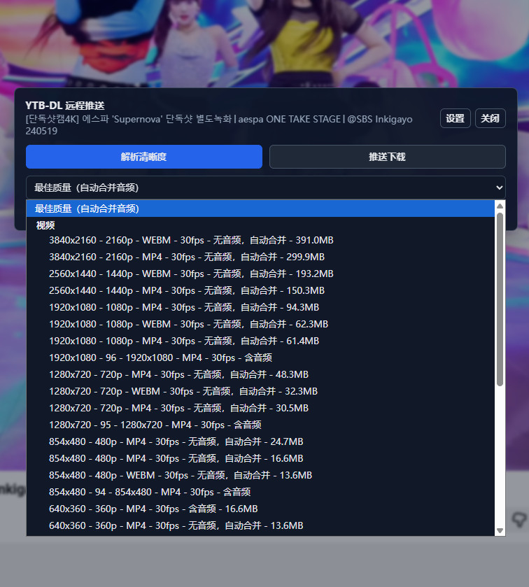</td>
  </tr>
</table>

## 快速部署

推荐使用 Docker / Docker Compose 部署。镜像由 GitHub Actions 自动构建并发布到 GHCR：

```text
ghcr.io/zipenok/ytb-dl:latest
```

下面是群晖 NAS 常用的目录映射示例：

```yaml
services:
  ytb-dl:
    image: ghcr.io/zipenok/ytb-dl:latest
    container_name: ytb-dl
    pull_policy: always
    ports:
      - "9832:9832"
    volumes:
      - ./config:/app/config
      - /volume1/Nas/downloads/youtube:/app/downloads
    environment:
      - TZ=Asia/Shanghai
      - PYTHONUNBUFFERED=1
      - PYTHONPATH=/app/config/python-packages:/app
      - YTDLP_UPDATE_DIR=/app/config/python-packages
      - HOST_DOWNLOAD_PATH=/volume1/Nas/downloads/youtube
      - WEB_AUTH_USERNAME=admin
      - WEB_AUTH_PASSWORD=change-this-password
      - API_TOKEN=change-this-api-token
      - AUTH_SECRET=change-this-session-secret
    restart: unless-stopped
```

启动：

```bash
docker compose pull
docker compose up -d
```

访问：

```text
http://<NAS-IP>:9832
```

首次部署时建议立刻修改 `WEB_AUTH_PASSWORD`、`API_TOKEN` 和 `AUTH_SECRET`，不要使用示例值。

群晖可以直接从 GitHub 拉取根目录的通用 compose 文件：

```bash
mkdir -p /volume1/docker/ytb-dl
cd /volume1/docker/ytb-dl
wget -O docker-compose.yml https://raw.githubusercontent.com/ZiPenOk/ytb-dl/main/docker-compose.yml
docker compose pull
docker compose up -d
```

群晖使用前建议把 compose 里的这几项改成你的 NAS 路径和随机密钥：

```yaml
HOST_DOWNLOAD_PATH: /volume1/Nas/downloads/youtube
WEB_AUTH_PASSWORD: your-password
API_TOKEN: your-api-token
AUTH_SECRET: your-random-session-secret
volumes:
  - /volume1/Nas/downloads/youtube:/app/downloads
  - /volume1/docker/ytb-dl/config:/app/config
```

## 配置说明

### 下载目录

容器内下载目录为：

```text
/app/downloads
```

群晖建议映射到：

```text
/volume1/Nas/downloads/youtube
```

同时设置：

```text
HOST_DOWNLOAD_PATH=/volume1/Nas/downloads/youtube
```

这样 Telegram 下载完成通知里会显示 NAS 上的真实文件路径，而不是容器内路径。

### 登录和 API Token

Web 页面使用 Cookie Session 登录。API 支持以下任一方式传递 Token：

```http
Authorization: Bearer <API_TOKEN>
```

或：

```http
X-API-Token: <API_TOKEN>
```

远程创建下载任务示例：

```bash
curl -X POST "http://<NAS-IP>:9832/api/download" \
  -H "Authorization: Bearer <API_TOKEN>" \
  -H "Content-Type: application/json" \
  -d '{"url":"https://www.youtube.com/watch?v=example","format_id":null}'
```

### Cookie

如果视频需要登录态，可以在 Web 设置中上传或指定 `cookies.txt`。

推荐方式：

1. 在浏览器安装 Get cookies.txt 一类扩展。
2. 打开 YouTube 并登录账号。
3. 导出 YouTube Cookie。
4. 在 YTB-DL 设置中上传或填入 Cookie 文件路径。

也可以配置 CookieCloud 自动同步。

### yt-dlp 更新

维护版支持把新版 yt-dlp 安装到持久化目录：

```text
/app/config/python-packages
```

这样即使镜像基础版本较旧，也可以通过 Web 更新按钮修复 YouTube 解析失败问题。

## Telegram 功能

### 下载通知

在高级设置中填写：

- Bot Token
- Chat ID
- 公网访问地址，可选
- 下载开始 / 完成 / 失败通知开关

下载完成通知会包含标题、作者、清晰度、大小、时长、文件路径、原始链接和任务 ID。

### 发送链接自动下载

启用“允许在 Telegram 发送链接触发下载”后，可以直接向配置的 Bot / 群发送 YouTube 链接。

支持的链接范围：

- `youtube.com`
- `m.youtube.com`
- `music.youtube.com`
- 其它 YouTube 子域名
- `youtu.be`

为了避免和其它项目互相抢消息，反向下载建议使用单独的 Telegram Bot Token。Telegram Bot 的消息接收侧只能有一个消费者；多个项目可以共用同一个 Bot 发送通知，但不能同时用同一个 Bot 接收消息。

如果在群里使用，并且 Bot 开启了 Privacy Mode，可以使用：

```text
/dl@你的机器人用户名 https://www.youtube.com/watch?v=example
```

或在 BotFather 中关闭该 Bot 的群隐私模式。

## 暴力猴远程推送脚本

脚本位置：

```text
tools/ytb-dl-violentmonkey.user.js
```

安装后在 YouTube 视频页会出现远程下载按钮。脚本支持：

- 配置 YTB-DL 服务地址。
- 配置 API Token。
- 解析当前视频。
- 选择清晰度。
- 推送远程下载任务。
- 保存常用设置。

脚本调用的是 YTB-DL 的 API，因此服务端必须开启并正确配置 `API_TOKEN`。

## API 简表

| 方法 | 路径 | 说明 |
| --- | --- | --- |
| `POST` | `/api/auth/login` | Web 登录 |
| `GET` | `/api/auth/status` | 登录状态 |
| `POST` | `/api/video-info` | 获取视频信息 |
| `POST` | `/api/download` | 创建下载任务 |
| `GET` | `/api/downloads/{task_id}` | 查询任务状态 |
| `GET` | `/api/history` | 下载历史 |
| `GET` | `/api/config` | 获取配置 |
| `POST` | `/api/config` | 保存配置 |
| `POST` | `/api/telegram/test` | 测试 Telegram 推送 |

除登录相关接口外，API 需要 Cookie Session 或 API Token。

## 项目结构

```text
.
├── frontend/                  # Web 前端
├── ytb/                       # 下载、配置、Cookie、更新等核心逻辑
├── telegram/                  # Telegram 推送和 Bot API 封装
├── tools/                     # 暴力猴远程推送脚本
├── docs/images/               # README 截图
├── main.py                    # FastAPI 服务入口
├── Dockerfile
├── docker-compose.yml
└── README.md
```

## 维护说明

本维护版重点解决以下问题：

- 原项目浏览器 Cookie 提取在 Docker / NAS 环境中不可用。
- YouTube 解析经常因 yt-dlp 版本过旧而失败。
- 单独下载视频流时容易出现无声音文件。
- 原项目缺少登录保护，不适合公网或反代暴露。
- 缺少适合移动端、Telegram 和浏览器脚本的远程推送入口。
- 企业微信相关功能已移除，当前维护方向以 Telegram 和开放 API 为主。

## 致谢

感谢原项目 [thsrite/ytb-dl](https://github.com/thsrite/ytb-dl) 提供基础实现。本项目在其基础上进行了面向个人 NAS 使用场景的修复、重构和功能扩展。

## License

本项目沿用原项目许可证。详见 [LICENSE](LICENSE)。
